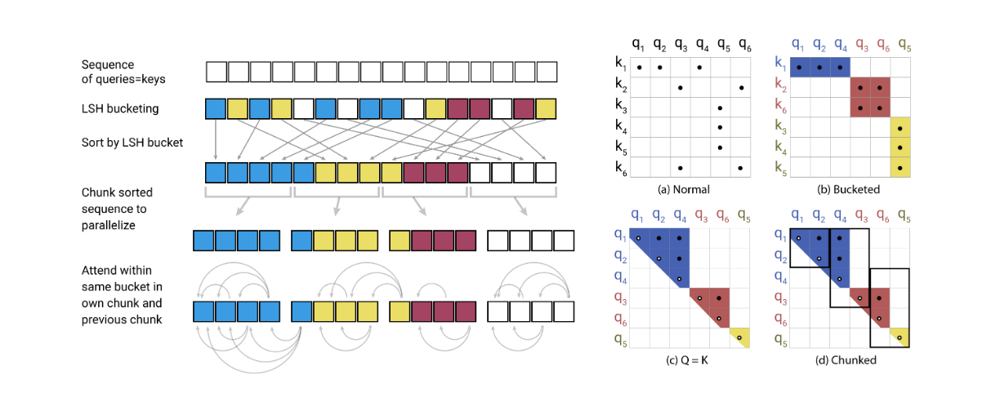

# Reformer, the Efficient Transformer, in Pytorch



This is a Pytorch implementation of Reformer https://openreview.net/pdf?id=rkgNKkHtvB

It includes LSH attention, reversible network, and chunking. It has been validated with an auto-regressive task (enwik8).

Test 32k tokens with Colab [](https://colab.research.google.com/drive/1am1DRl80Kd3o6n_4u3MomPzYS0NfdHAC)

## Install

```bash
pip install reformer_pytorch
```

## Usage

A simple Reformer language model

```python
# should fit in ~ 5gb - 8k tokens

import torch
from reformer_pytorch import ReformerLM

model = ReformerLM(
    num_tokens= 20000,
    emb = 512,
    depth = 12,
    max_seq_len = 8192,
    heads = 8,
    lsh_dropout = 0.1,
    causal = True,        # auto-regressive or not
    bucket_size = 64,     # average size of qk per bucket, 64 was recommended in paper
    n_hashes = 4,         # 4 is permissible per author, 8 is the best but slower
    ff_chunks = 200,      # number of chunks for feedforward layer, make higher if there are memory issues
    weight_tie = False,   # tie parameters of each layer for no memory per additional depth
    attn_chunks = 8,        # process lsh attention in chunks, only way for memory to fit when scaling to 16k tokens
    use_full_attn = False,  # use full self attention, for comparison
    num_mem_kv = 128        # persistent learned memory key values, from all-attention paper
).cuda()

x = torch.randint(0, 20000, (1, 8192)).long().cuda()
y = model(x) # (1, 8192, 20000)
```

The Reformer (just a stack of reversible LSH attention)

```python
# should fit in ~ 5gb - 8k embeddings

import torch
from reformer_pytorch import Reformer

model = Reformer(
    emb = 512,
    depth = 12,
    max_seq_len = 8192,
    heads = 8,
    lsh_dropout = 0.1,
    causal = True
).cuda()

x = torch.randn(1, 8192, 512).cuda()
y = model(x) # (1, 8192, 512)
```

Self Attention with LSH

```python
import torch
from reformer_pytorch import LSHSelfAttention

attn = LSHSelfAttention(
    emb = 128,
    heads = 8,
    bucket_size = 64,
    n_hashes = 8,
    causal = False
)

x = torch.randn(10, 1024, 128)
y = attn(x) # (10, 1024, 128)
```

LSH (locality sensitive hashing) Attention

```python
import torch
from reformer_pytorch import LSHAttention

attn = LSHAttention(
    bucket_size = 64,
    n_hashes = 16,
    causal = True
)

qk = torch.randn(10, 1024, 128)
v = torch.randn(10, 1024, 128)

attn_out, buckets = attn(qk, v) # (10, 1024, 128)
# buckets will contain the bucket number (post-argmax) of each token of each batch
```

## Todo

1. Make it so Reformer can be used as decoder where queries only attend to fed key/values (in progress)
2. Recurrence like Transformer XL
3. ~~All-attention learned memory key values~~

## Citations
```
@inproceedings{
    kitaev2020reformer,
    title={Reformer: The Efficient Transformer},
    author={Nikita Kitaev and Lukasz Kaiser and Anselm Levskaya},
    booktitle={International Conference on Learning Representations},
    year={2020},
    url={https://openreview.net/forum?id=rkgNKkHtvB}
}
```

```
@article{DBLP:journals/corr/abs-1907-01470,
  author    = {Sainbayar Sukhbaatar and
               Edouard Grave and
               Guillaume Lample and
               Herv{\'{e}} J{\'{e}}gou and
               Armand Joulin},
  title     = {Augmenting Self-attention with Persistent Memory},
  journal   = {CoRR},
  volume    = {abs/1907.01470},
  year      = {2019},
  url       = {http://arxiv.org/abs/1907.01470}
}
```